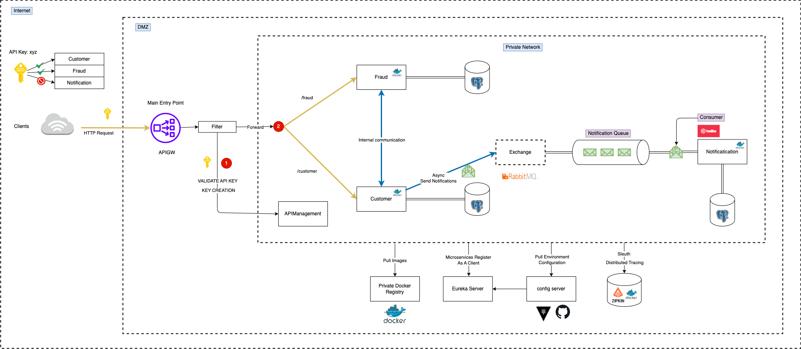

# Microservices and Distributed Systems

This project is built from the course [Microservices and Distributed Systems](https://app.amigoscode.com/p/microservices) of Amigoscode.

## Project Architecture

## Related Project

Kafka Sample Project:
https://github.com/MinhQuan992/kafka-sample
